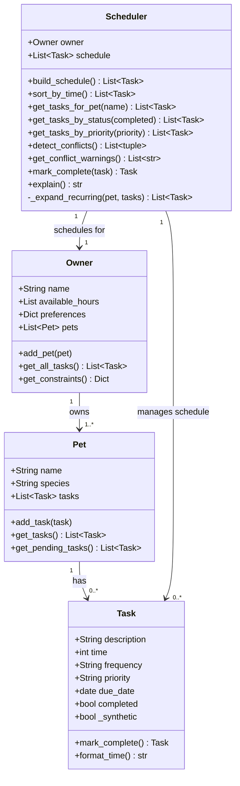

# PawPal+

**PawPal+** is a Streamlit app that helps pet owners build a structured daily care schedule for their pets. It handles task prioritization, recurring reminders, availability filtering, and conflict detection.

---

## Classes

PawPal+ is built around four classes that map directly to the real-world concepts of pet care.

| Class | Responsibility |
|---|---|
| `Task` | Represents one care action (e.g., "Morning walk"). Holds a description, start time, frequency, priority, due date, and completion status. Knows how to mark itself complete and produce the next scheduled occurrence. |
| `Pet` | Represents an individual pet. Owns a list of `Task` objects and exposes methods to add tasks and retrieve pending ones. |
| `Owner` | Represents the person caring for the pets. Holds a list of `Pet` objects and defines the daily availability window and preferences used by the scheduler. |
| `Scheduler` | Orchestrates the full daily plan across all of the owner's pets. Builds, sorts, filters, and conflict-checks the schedule, and handles auto-rescheduling when tasks are marked complete. |

### Class diagram (Mermaid)



---

## Features

### Priority-based scheduling
Tasks are ranked **high → medium → low** when the schedule is generated. Within the same priority level, tasks are sorted by time so earlier tasks always appear first. This ensures the most critical care never gets buried.

### Chronological view
Switch from priority order to a **time-sorted view** at any time. The app calls `sort_by_time()` to give you a chronological "what's next" list, useful at a glance during the day without changing how the schedule was built.

### Availability window filtering
The owner sets a **daily availability window** (from/until time) when creating their profile. The scheduler automatically filters out any task that falls outside that window before building the schedule, so only tasks you can actually do appear in the plan.

### Recurring task auto-rescheduling
Mark a `daily` or `weekly` task complete and the **next occurrence is created automatically** with no manual re-adding. The new task's due date is calculated using Python's `timedelta` and inserted directly into the live schedule.

### Twice-daily task expansion
Tasks set to `twice_daily` are automatically **split into two time slots** 12 hours apart. The second slot is a synthetic copy that tracks completion independently but never triggers its own rescheduling, so the original task stays in control of the recurring cycle.

### Conflict detection and warnings
Before displaying the schedule, the app scans for **tasks booked at the exact same minute**. Every conflicting pair is surfaced as a warning with the task names, their pets, and whether the clash is within the same pet or across different pets. The app never crashes on a conflict. It just flags the problem so you can decide what to do.

### Per-pet breakdown
The schedule is filterable **by individual pet** using `get_tasks_for_pet()`. Each pet gets a collapsible panel showing their tasks sorted chronologically, with pending/done counts visible in the header.

### Live status tracking
`get_tasks_by_status()` reads the live `completed` flag on each task, so the pending/done split stays accurate after any task is marked complete during the session.

### Next available slot (stretch feature)
`find_next_slot(preferred_time)` scans forward from a given time and returns the first minute that's inside the owner's availability window and not already taken by a scheduled task. It goes minute by minute up to a full 24 hours, so it'll always find something as long as there's any free slot at all. I used Agent Mode to figure out the right algorithm here. I asked it to come up with something that didn't need a task duration field since `Task` doesn't have one, and it landed on a linear scan over the set of occupied minutes which is simple and correct.

### Data persistence (stretch feature)
`Owner.save_to_json(path)` and `Owner.load_from_json(path)` write and read the full owner, pet, and task data as a `data.json` file. No extra libraries needed. Each class has a `to_dict` and `from_dict` method that handles the conversion. The Streamlit app auto-loads `data.json` on startup if the file exists, and there's a Save button to persist any changes. I used Agent Mode to plan the multi-file changes. The main thing it caught that I would've missed is that Python `date` objects and `available_hours` tuples don't survive a JSON round-trip without conversion. Dates need `.isoformat()` / `date.fromisoformat()` and tuples need to be converted to lists and back.

---

## Getting started

### Setup

```bash
python -m venv .venv
source .venv/bin/activate  # Windows: .venv\Scripts\activate
pip install -r requirements.txt
```

### Run the demo script

Demonstrates the full system end-to-end in the terminal: two pets, five tasks, sorting, filtering, conflict detection, and auto-rescheduling.

```bash
python main.py
```

### Run the Streamlit app

```bash
streamlit run app.py
```

### Run the test suite

```bash
python -m pytest tests/test_pawpal.py -v
```

---

## Testing PawPal+

### What the tests cover

| Area | Tests | Description |
|---|---|---|
| **Sorting correctness** | 3 | Verifies high → medium → low priority order and time as a tiebreaker within the same priority |
| **Recurrence logic** | 5 | Confirms daily tasks reschedule +1 day, weekly tasks +7 days, one-off tasks return `None`, and the new task lands in both the pet's list and the live schedule |
| **Twice-daily expansion** | 4 | Checks that a `twice_daily` task expands to two slots 720 minutes apart, that the second copy is flagged synthetic (no re-rescheduling), and that midnight wraparound is handled correctly |
| **Conflict detection** | 4 | Validates that two tasks at the same minute produce one pair, three tasks produce three pairs (C(3,2)), no-conflict cases return an empty list, and warning strings are human-readable |
| **Error / edge cases** | 8 | Guards against double-completion, orphan tasks, no pets, no pending tasks, all tasks outside the availability window, and calling sort/detect before `build_schedule()` |

**Total: 26 tests — all passing.**

### Confidence Level

**4 / 5 stars**

The core scheduling behaviors (priority sort, recurrence, conflict detection, twice-daily expansion, and availability filtering) are fully covered with both happy-path and error-path tests. One star is withheld because the `prefers_morning` preference branch in `build_schedule()` has no effect on the sort key as currently written, and cross-pet conflict scenarios with more than two pets are not yet tested.
